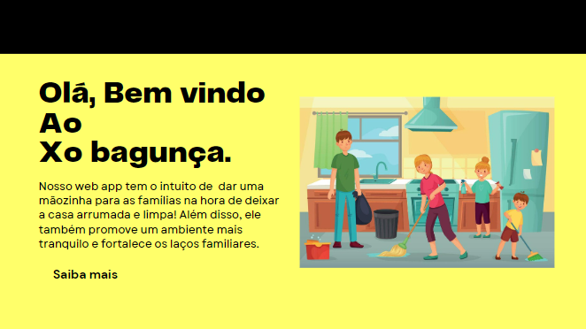

# xo_bagunca
# índice

[Projeto- Criando um Aplicativo para organização](#projeto--organização-melhoria-em-casa)  
[Descrição](#descri%C3%A7%C3%A3o)  
[Introdução](#introdu%C3%A7%C3%A3o)  
[Funcionalidades](#funcionalidades)  
[Tecnologia utilizada](#tecnologia-utilizadas)  
[Fontes consultadas](#fontes-consultadas)  
[Autores](#autores)  

# Projeto Tcc 🚀 - criando uma solução para o problema

 

## Descrição📝
 O aplicativo "𝗫𝗼 𝗕𝗮𝗴𝘂𝗻𝗰̧𝗮" é uma ferramenta valiosa para famílias que buscam manter a ordem em suas casas e fortalecer seus laços. Ao facilitar a organização do lar, o aplicativo contribui para um ambiente mais tranquilo e harmonioso, onde os membros da família podem se concentrar em compartilhar momentos significativos juntos, em vez de lidar com o estresse da desordem. Além disso, ao incentivar a colaboração e o trabalho em equipe na gestão das tarefas domésticas, o "Xo Bagunça" promove uma maior coesão familiar e um senso de responsabilidade compartilhada, resultando em relações familiares mais saudáveis e felizes.

## Introdução📌
Esta ferramenta foi desenvolvida para auxiliar os usuários na organização equitativa de suas casas. O site foi criado com o objetivo de facilitar e ajudar os usuários a se organizarem em seus lares.

## Funcionalidades ⚙️
Ao acessar o app o usuário será direcionado para a página inicial, lá ira aparecer as funções, sendo elas: 
  - `Login`: O usuário terá que colocar seu email e login.
 -  `pin`: Esse campo será utilizado para que o usuario logue pelo pin.
  - `Esqueceu a senha`: Caso o usuario tenha esqeucido sua senha so basta clicar no 𝗲𝘀𝗾𝘂𝗲𝗰𝗲𝘂 𝘀𝘂𝗮 𝘀𝗲𝗻𝗵𝗮 para que assim seja gerado um código que chegara no email e irá ajuda-lo a recuperar ou criar uma senha nova.
 - `SIGA O EXEMPLO NO VIDEO ABAIXO 👇 `
 
  

 ### Tecnologia utilizadas ⌨️ 
* 𝗛𝗧𝗠𝗟
* 𝗖𝗦𝗦
* 𝗚𝗜𝗧𝗛𝗨𝗕

## Fontes consultadas 🛠️

## Autores ✒️
- `Alex`
- `Leonardo`
- `Julia` https://github.com/juliaburque
- `Veronica`

